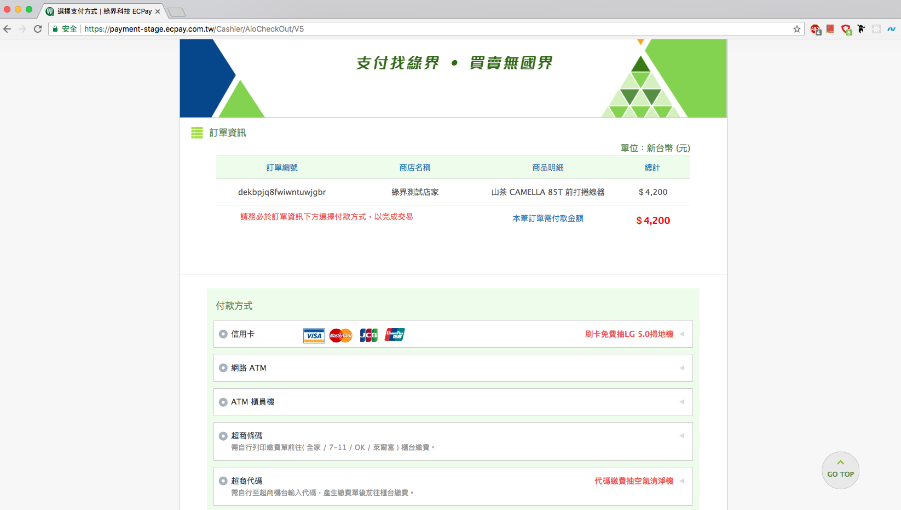
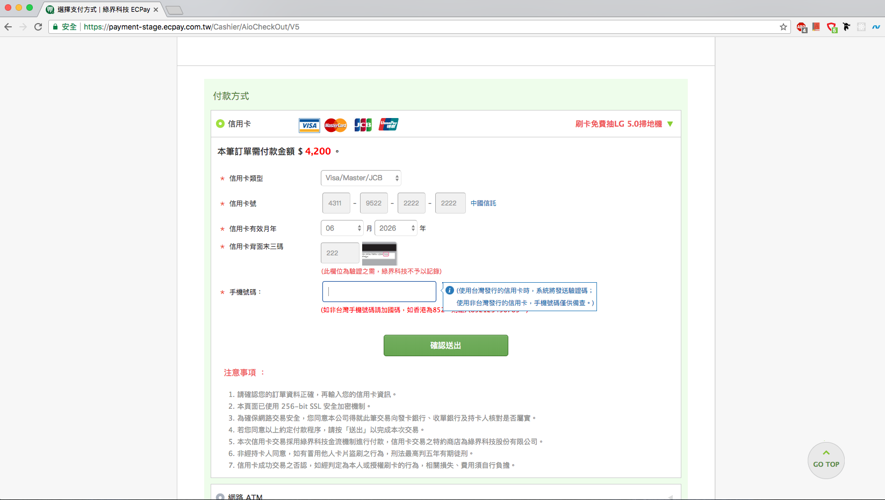
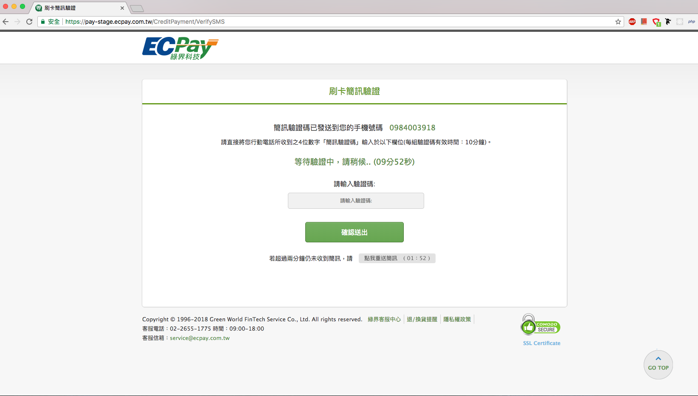
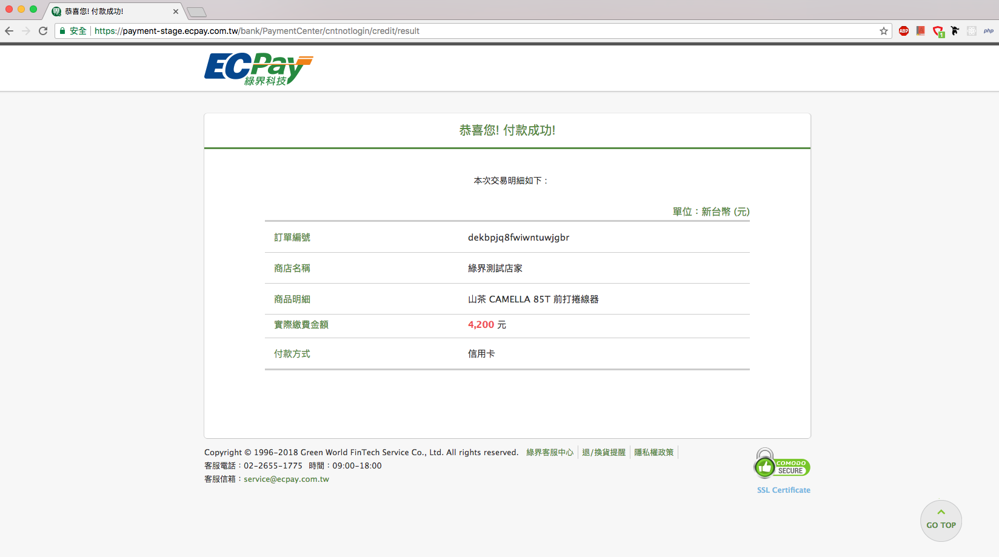

[![GitHub license][license-image]][license-url]

# 綠界金流介接測試

## API

- Currently this repo is connecting with Heroku: 
https://ecpay-payment.herokuapp.com/

- For more detail about ecpy's document: https://www.ecpay.com.tw/Content/files/ecpay_011.pdf

## 路徑(Router)
### 1. 結帳頁面(網頁跳轉夾帶值方法)
**方法:** GET

**說明:** *經由綠界取得收付款服務(網頁跳轉夾帶值方法)*

**路徑:** *`https://ecpay-payment.herokuapp.com/api/ecpay/get?total=:total&item=:item`*

- [範例] URL parameter 
  - https://ecpay-payment.herokuapp.com/api/ecpay/get?total=4200&item=山茶 CAMELLA 85T 前打捲線器&name=王小明&address=台中市&email=andy6804tw@yahoo.com.tw&note=無

### 2. 結帳頁面(表單傳送方法)
**方法:** POST

**說明:** *經由綠界取得收付款服務(表單傳送方法)*

**路徑:** *`https://ecpay-payment.herokuapp.com/api/ecpay`*

- Parameters (body):
```json
// form-data

total: 4200
item: 山茶 CAMELLA 85T 前打捲線器
```

[範例測試](https://codepen.io/andy6804tw/full/EEPQqz/)

### 3. 查詢訂單
**方法:** GET

**說明:** *使用訂單編號做訂單查詢*

**路徑:** *`https://ecpay-payment.herokuapp.com/api/ecpay/queryTradeInfo?merchantTradeNo=訂單編號`*

- [範例] URL parameter 
  - https://ecpay-payment.herokuapp.com/api/ecpay/queryTradeInfo?merchantTradeNo=vbqg6003rqrn6zace1cr

[參考文件](https://hackmd.io/901APtwTRFCRCx1TL0byOQ)

## 功能(Feature)
- 付款方式
  - 信用卡
  - 網路 ATM
  - ATM 櫃員機
  - 超商條碼
  - 超商代碼



## 功能(Feature)
- 付款方式
  - 信用卡
  - 網路 ATM
  - ATM 櫃員機
  - 超商條碼
  - 超商代碼


### 信用卡付款

##### 1. 輸入信用卡資訊及手機號碼

- 信用卡測試卡號
```json
卡號: 4311-9522-2222-2222 (注意：只有此組卡號可測試交易成功流程)

安全碼: 222

有效月/年: 輸入的 MM/YYYY 值請大於現在當下時間的月年，例如在 2016/04/20 當天作測試，請設定 05/2016(含)之後的有效月年，否則回應刷卡失敗。
```



##### 2. 刷卡簡訊驗證

> Note: 每組簡訊驗證碼有效期限10分鐘



##### 3. 付款成功

付款成功後會顯示成功頁面，且付款驗證同時會進入 `ReturnURL` 與 `OrderResultURL` 做 callback 動作，開發者必須自定義 callback 內容。



### 網路 ATM
- 網路銀行

  - 兆豐國際商銀、台灣土地銀行、新光銀行、永豐銀行、台灣銀行、國泰世華銀行、中國信託、玉山銀行、第一銀行、台北富邦、台新銀行、其他金融機構。

> Note:若使用其他金融機構進行轉帳，可至任一銀行之櫃員機操作，另須支付跨行手續費 15 元。

## LICENSE 
MIT


[license-image]: https://img.shields.io/npm/l/express.svg?registry_uri=https%3A%2F%2Fregistry.npmjs.com
[license-url]: https://github.com/andy6804tw/ecpay-payment-demo/blob/master/LICENSE
